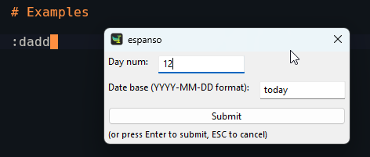

# dadd - Date Add

This package is an utility for quick date calculation like insert the date that is +12 from tomorrow,
or -5 day from today.

The package contain only one trigger that is :dadd (short for date add).



The form has two field: 
   - Day num: Number of days to add or extract. For extraction use negative number.
   - Date base (YYYY-MM-DD format): The date that will be used for add or extract. 'Today' and 'Now' are also valid values. 'Today' is the default.

The output will be also in YYYY-MM-DD format.

# Installation

```
espanso install dadd
espanso restart
```
