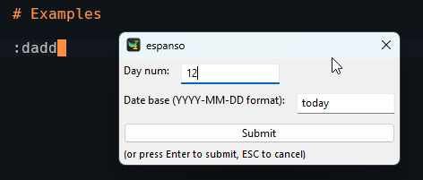

# dadd - Date Add

This package is a utility for quick date calculations like insert the date that is +12 from tomorrow,
or -5 days from today.

The package contains only one trigger that is :dadd (short for date add).

The form has two fields:
   - Day num: Number of days to add or subtract. For subtraction use negative numbers.
   - Date base (YYYY-MM-DD format): The date that will be used to add or subtract days. 'Today' and 'Now' are also valid values. 'Today' is the default.

The output will be also in YYYY-MM-DD format.
