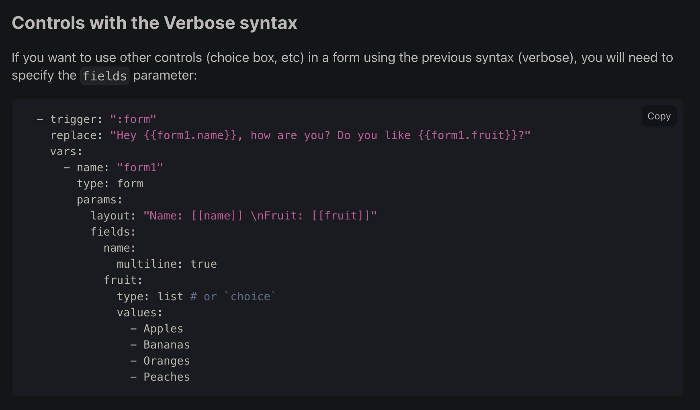

# Espanso Choice Extension Shortcut

> This package allows you to quickly create a new espanso shortcut with the choice extension. Please see the example below. 


## Usage

Let's say you want to create a new espanso shortcut that will allow you to choose between different options such as a list of colors that you frequently use in styling. Or you have a list of co-worker logins that you need to use but can't always remember off hand. You can use the choice extension to quickly generate a shortcut template that you can customize to give you a list of options to choose from.


Please see [](https://www.youtube.com/watch?v=VEGv4aHV1d8)
for a short video demo


```yaml

# Example usage

  - triggers: ['csscolors--', 'csscol--']
    replace: "color:  {{CSS.color_name}}"
    vars:
      - name: "CSS"
        type: form
        params:
          layout: "color_name: [[color_name]]" 
          fields:
            color_name:
              type: list
              values:
              - red
              - orange
              - black
              - white
              - green
              - blue
              - purple
              - pink
              - yellow
              - brown
              - gray
              - cyan
              - magenta
              - lime
              - teal
              - indigo
              - violet
              - fuchsia
              - aqua
              - maroon
              - navy
              - olive
              - silver
              - limegreen
              - skyblue
              - tan

```

## Source 

Please refer to the awesome documentation for verbose syntax forms here https://espanso.org/docs/matches/forms/#controls-with-the-verbose-syntax




## Notes

I added manual unicode value for white space `\u0020` and `\n` for new line. This is because I had issues with vscode settings interfering with my YAML spacing and I found that just writing shortcuts like this was easier. 