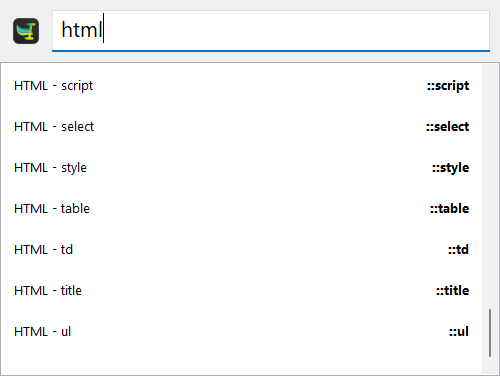

# html-utils-package

Make HTML5 easier and less time-consuming with this [Espanso](https://espanso.org/) package!

# Installation

Make sure you have already installed [Espanso](https://espanso.org/install/) first.

```
espanso install html-utils-package
```

That's all. You can start using the package. Open your favorite editor and type `::docskel` to test!

# Preview

You can choose between all of them from the Search-bar:


# Triggers

Here you can see some of them:

| Trigger  | Result |
| ------------- | ------------- |
| `::docskel` | Generates an empty document with `utf-8` and `viewport` headers (unindented) |
| `::doctype` | `<!DOCTYPE html>` |
| `::meta-charset` | `<meta charset="">` |
| `::meta-utf-8` | `<meta charset="UTF-8">` |
| `::meta-viewport` | `<meta name="viewport" content="width=device-width, initial-scale=1">` |
| `::meta-author` | `<meta name="author" content="">` |
| `::meta-desc` | `<meta name="description" content="">` |
| `::meta-keywords` | `<meta name="keywords" content="">` |
| `::title` | `<title></title>` |
| `::div` | `<div></div>` |
| `::html` | `<html></html>` |
| `::head` | `<head></head>` |
| `::body` | `<body></body>` |
| `::a` | `<a href=""></a>` |
| `::br` | `<br>` |
| `::button` | `<button type="button"></button> ` |
| `::style` | `<style></style>` |
| `::css` | `<link rel="stylesheet" type="text/css" href="">` |
| `::script` | `<script></script>` |
| `::js` | `<script type="text/javascript" src=""></script>` |
| `::form` | `<form action="" method=""></form>` |
| `::label` | `<label for=""></label>` |
| `::input-submit` | `<input type="submit" value="">` |
| `::input-text` | `<input type="text" name="" id="">` |
| `::input-password` | `<input type="password" name="" id="">` |
| `::input-radio` | `<input type="radio" name="" id="" value="">` |
| `::input-checkbox` | `<input type="checkbox" name="" id="" value="">` |
| `::input-file` | `<input type="file" name="" id="">` |

# Contributions
If you feel like there's any important tag/snippet missing, feel free to create a Pull Request or open an [Issue](https://github.com/woodenbell/html-utils-package/issues/new).