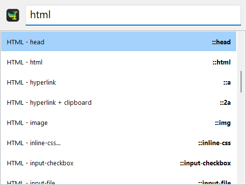

# html-utils-package

Make HTML5 easier and less time-consuming with this [Espanso](https://espanso.org/) package!

## Installation

Make sure you have already installed [Espanso](https://espanso.org/install/) first.

```
espanso install html-utils-package
```

That's all. You can start using the package. Open your favorite editor and type `::docskel` to test!

## Update

If you already have the package installed and want to update it, just type:

```
espanso package update html-utils-package
```
## Test

To list the installed packages and their versions, you have to type:

```
espanso package list
```
## Preview

You can choose between all of them from the Search-bar filtering by `html`:



## Triggers

Here you can see part of the content:

| Trigger  | Result |
| ------------- | ------------- |
| `::docskel` | Generates an empty document with `utf-8` and `viewport` headers (unindented) |
| `::meta-utf-8` | `<meta charset="UTF-8">` |
| `::meta-viewport` | `<meta name="viewport" content="width=device-width, initial-scale=1">` |
| `::meta-keywords` | `<meta name="keywords" content="">` |
| `::script` | `<script></script>` |
| `::div` | `<div></div>` |
| `::a` | `<a href=""></a>` |
| `::2a` | `<a href="" target="_blank" rel="noopener noreferrer"></a>` |
| `::br` | `<br>` |
| `::com` | `<!-- -->` |
| `::button` | `<button type="button"></button> ` |
| `::style` | `<style></style>` |
| `::css` | `<link rel="stylesheet" type="text/css" href="">` |


## Contributions
If you feel like there's any important tag/snippet missing, feel free to create a Pull Request or open an [Issue](https://github.com/jczanfona/html-utils-package/issues/new).
